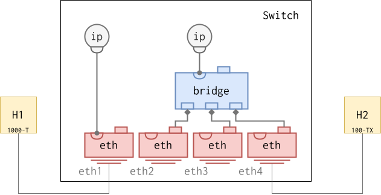
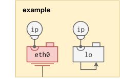

# Network Configuration

Infix aims to support all Linux Networking constructs.  The YANG models
used to describe the system are chosen to fit well and leverage the
underlying Linux kernel's capabilities.  The [ietf-interfaces.yang][1]
model forms the base, extended with [ietf-ip.yang][2] and other layer-3
IETF models.  The layer-2 bridge and aggregate models are defined by
Infix to exploit the unique features not available in IEEE models.

> **Note:** when issuing `leave` to activate your changes, remember to
> also save your settings, `copy running-config startup-config`.  See
> the [CLI Introduction](cli/introduction.md) for a background.


## Interface LEGO®

The network building blocks available in Linux are akin to the popular
LEGO® bricks.


There are two types of relationships that can link two blocks together:

  1. **Lower-to-upper**: Visually represented by an extruding square
     connected upwards to a square socket.  An interface _can only have
     a single_ lower-to-upper relationship, i.e., it can be attached to
     a single upper interface like a bridge or a LAG.  In `iproute2`
     parlance, this corresponds to the interface's `master` setting
  2. **Upper-to-lower**: Visually represented by an extruding semicircle
     connected downwards to a semicircle socket.  The lower interface in
     these relationships _accepts multiple_ upper-to-lower relationships
     from different upper blocks.  E.g., multiple VLANs and IP address
     blocks can be connected to the same lower interface


An interface may simultaneously have a _lower-to-upper_ relation to some
other interface, and be the target of one or more _upper-to-lower_
relationships.  It is valid, for example, for a physical port to be
attached to a bridge, but also have a VLAN interface stacked on top of
it.  In this example, traffic assigned to the VLAN in question would be
diverted to the VLAN interface before entering the bridge, while all
other traffic would be bridged as usual.

| **Type** | **Yang Model**             | **Description**                                               |
| -------- | -----------------          | ------------------------------------------------------------- |
| bridge   | infix-if-bridge            | SW implementation of an IEEE 802.1Q bridge                    |
| ip       | ietf-ip, infix-ip          | IP address to the subordinate interface                       |
| vlan     | infix-if-vlan              | Capture all traffic belonging to a specific 802.1Q VID        |
| lag[^1]  | infix-if-lag               | Bonds multiple interfaces into one, creating a link aggregate |
| lo       | ietf-interfaces            | Software loopback interface                                   |
| eth      | ietf-interfaces,           | Physical Ethernet device/port                                 |
|          | ieee802-ethernet-interface |                                                               |
| veth     | infix-if-veth              | Virtual Ethernet pair, typically one end is in a container    |


## Data Plane

The blocks you choose, and how you connect them, defines your data plane.
Here we see an example of how to bridge a virtual port with a physical
LAN.


Depending on the (optional) VLAN filtering of the bridge, the container
may have full or limited connectivity with outside ports, as well as the
internal CPU.

In fact the virtual port connected to the bridge can be member of
several VLANs, with each VLAN being an interface with an IP address
inside the container.

Thanks to Linux, and technologies like switchdev, that allow you to
split a switching fabric into unique (isolated) ports, the full
separation and virtualization of all Ethernet layer properties are
possible to share with a container.  Meaning, all the building blocks
used on the left hand side can also be used freely on the right hand
side as well.

### Bridging

This is the most central part of the system.  A bridge is a switch, and
a switch is a bridge.  In Linux, setting up a bridge with ports
connected to physical switch fabric, means you manage the actual switch
fabric!

In Infix ports are by default not switch ports, unless the customer
specific factory config sets it up this way.  To enable switching
between ports you create a bridge and then add ports to that
bridge. That's it.

```
admin@example:/> configure
admin@example:/config/> edit interface br0
admin@example:/config/interface/br0/> up
admin@example:/config/> set interface eth0 bridge-port bridge br0
admin@example:/config/> set interface eth1 bridge-port bridge br0
admin@example:/config/> leave
```

Here we add two ports to bridge `br0`: `eth0` and `eth1`.

> **Note:** Infix has many built-in helpers controlled by convention.
> E.g., if you name your bridge `brN`, where `N` is a number, Infix sets
> the interface type automatically and unlocks all bridge features.
> Other "magic" names are `ethN.M` for VLAN M on top of `ethN`, or
> `dockerN` to create an IP masquerading container bridge.

#### VLAN Filtering Bridge

By default bridges in Linux do not filter based on VLAN tags.  It can be
enabled in Infix when creating a bridge by adding a port to a VLAN as a
tagged or untagged member.  Use the port default VID (PVID) setting to
control VLAN association for traffic ingressing a port untagged (default
PVID: 1).

```
admin@example:/config/> edit interface br0
admin@example:/config/interface/br0/> up
admin@example:/config/> set interface eth0 bridge-port bridge br0
admin@example:/config/> set interface eth0 bridge-port pvid 10
admin@example:/config/> set interface eth1 bridge-port bridge br0
admin@example:/config/> set interface eth1 bridge-port pvid 20
admin@example:/config/> edit interface br0
admin@example:/config/interface/br0/> set bridge vlans vlan 10 untagged eth0
admin@example:/config/interface/br0/> set bridge vlans vlan 20 untagged eth1
```

This sets `eth0` as an untagged member of VLAN 10 and `eth1` as an
untagged member of VLAN 20.  Switching between these ports is thus
prohibited.

To terminate a VLAN in the switch itself, either for switch management
or for routing, the bridge must become a (tagged) member of the VLAN.

```
admin@example:/config/interface/br0/> set bridge vlans vlan 10 tagged br0
admin@example:/config/interface/br0/> set bridge vlans vlan 20 tagged br0
```

> To route or to manage via a VLAN, a VLAN interface needs to be created
> on top of the bridge, see section [VLAN Interfaces](#vlan-interfaces)
> below for more on this topic.

#### Multicast Filtering and Snooping

Multicast filtering in the bridge is handled by the bridge itself.  It
can filter both IP multicast and MAC multicast.  For IP multicast it
also supports "snooping", i.e., IGMP and MLD, to automatically reduce
the broadcast effects of multicast.  See the next section for a summary
of the [terminology used](#terminology--abbreviations).

> **Note:** currently there is no way to just enable multicast filtering
> without also enabling snooping.  This may change in the future, in
> which case a `filtering` enabled setting will be made available along
> with the existing `snooping` setting.

When creating your bridge you must decide if you need a VLAN filtering
bridge or a plain bridge (see previous section).  Multicast filtering is
supported for either, but take note that it must be enabled and set up
per VLAN when VLAN filtering is enabled -- there are no global multicast
settings in this operating mode.

In the following example we have a regular 8-port bridge without VLAN
filtering.  We focus on the multicast specific settings:

```
admin@example:/> configure
admin@example:/config/> edit interface br0
admin@example:/config/interface/br0/> set bridge multicast snooping
admin@example:/config/interface/br0/> set ipv4 address 192.168.2.1 prefix-length 24
admin@example:/config/interface/br0/> leave
admin@example:/> copy running-config startup-config
```

Here we enable snooping and set a static IPv4 address so that the switch
can take part in IGMP querier elections.  (MLD querier election
currently not supported.)  We can inspect the current state:

```
admin@example:/> show ip multicast
Multicast Overview
Query Interval (default): 125 sec
Router Timeout          : 255
Fast Leave Ports        :
Router Ports            :
Flood Ports             : e0, e1, e2, e3, e4, e5, e6, e7

Interface       VID  Querier                     State  Interval  Timeout  Ver
br0                  192.168.2.1                    Up       125     None    3

Bridge          VID  Multicast Group       Ports
br0                  224.1.1.1             e3, e2
br0                  ff02::6a              br0
```

It is a small LAN, so our bridge has already become the elected IGMP
querier.  We see it is ours because the timeout is `None`, and we
recognize our IP address.  We can also see two ports that have joined
the same IPv4 multicast group, 224.1.1.1, and one join from Infix itself
for the IPv6 group ff02::6a.

Now, let's see what happens when we add another bridge, with VLAN
filtering enabled.  We skip the boring parts about how to move ports
e4-e7 to `br1` and assign them to VLANs, and again, focus on the
multicast bits only:

```
admin@example:/> configure
admin@example:/config/> edit interface br1
admin@example:/config/interface/br1/> set bridge vlans vlan 1 multicast snooping
admin@example:/config/interface/br1/> set bridge vlans vlan 2 multicast snooping
admin@example:/config/interface/br1/> leave
admin@example:/> copy running-config startup-config
```

Let's see what we get:

```
admin@example:/> show ip multicast
Multicast Overview
Query Interval (default): 125 sec
Router Timeout          : 255
Fast Leave Ports        : e5
Router Ports            : e1, e2, e5, e6, e7
Flood Ports             : e1, e2, e3, e4, e5, e6, e7, e8

Interface       VID  Querier                     State  Interval  Timeout  Ver
br0                  192.168.2.1                    Up       125     None    3
br1               1  0.0.0.0                        Up       125     None    3
br1               2  0.0.0.0                        Up       125     None    3

Bridge          VID  Multicast Group       Ports
br0                  224.1.1.1             e2
br0                  ff02::fb              br0
br0                  ff02::6a              br0
br0                  ff02::1:ff00:0        br0
br1               1  224.1.1.1             e5
br1               2  224.1.1.1             e7
br1               1  ff02::fb              br1
br1               1  ff02::1:ff00:0        br1
```

In this setup we have a lot more going on.  Multiple multicast router
ports have been detected, and behind the scenes someone has also added
an IGMP/MLD fast-leave port.

##### Terminology & Abbreviations

 - **IGMP**: Internet Group Membership Protocol, multicast subscription
   for IPv4, for details see [RFC3376][]
 - **MLD**: Multicast Listener Discovery (Protocol), multicast
   subscription for IPv6, for details see [RFC3810][]
 - **Unknown/Unregistered multicast**: multicast groups that are *not*
   in the multicast forwarding database (MDB)
 - **Known/Registered multicast**: multicast groups that *are* in the
   multicast forwarding database (MDB)
 - **MDB**: the multicast forwarding database, consists of filters for
   multicast groups, directing where multicast is allowed to egress.  A
   filter entry consists of a group and a port list.  The bridge filters
   with a unique database per VLAN, in the same was as the unicast FDB
 - **Join/Leave**: the terminology used in earlier versions of the two
   protocols to subscribe and unsubscribe to a multicast group.  For
   more information, see *Membership Report*
 - **Membership Report** A membership report is sent by end-devices and
   forwarded by switches to the elected querier on the LAN.  They
   consist of multiple "join" and "leave" operations on groups.  They
   can also, per group, list which senders to allow or block.  Switches
   usually only support the group subscription, and even more common
   also only support filtering on the MAC level[^3]
 - **Querier election**: the process of determining who is the elected
   IGMP/MLD querier on a LAN.  Lowest numerical IP address wins, the
   special address 0.0.0.0 (proxy querier) never wins
 - **Proxy querier**: when no better querier exists on a LAN, one or
   more devices can send proxy queries with source address 0.0.0.0 (or
   :: for IPv6).  See **Query Interval**, below, why this is a good
   thing
 - **Query interval**: the time in seconds between two queries from an
   IGMP/MLD querier.  It is not uncommon that end-devices do not send
   their membership reports unless they first hear a query
 - **Fast Leave**: set on a bridge port to ensure multicast is pruned as
   quickly as possible when a "leave" membership report is received.  In
   effect, this option marks the port as directly connected to an
   end-device.  When not set (default), a query with timeout is first
   sent to ensure no unintentional loss of multicast is incurred
 - **Router port**: can be both configured statically and detected at
   runtime based on connected devices, usually multicast routers.  On
   a router port *all* multicast is forwarded, both known and unknown
 - **Flood port**: set on a bridge port (default: enabled) to ensure
   all *unknown* multicast is forwarded
 - **Router timeout**: the time in seconds until a querier is deemed to
   have been lost and another device (switch/router) takes over.  In the
   tables shown above, a *None* timeout is declared when the current
   device is the active querier

> **Note:** the reason why multicast flooding is enabled by default is
> to ensure safe co-existence with MAC multicast, which is very common
> in industrial networks.  It also allows end devices that do not know
> of IGMP/MLD to communicate over multicast as long as the group they
> have chosen is not used by other IGMP/MLD aware devices on the LAN.
>
> As soon as an IGMP/MLD membership report to "join" a group is received
> the group is added to the MDB and forwarding to other ports stop.  The
> only exception to this rule is multicast router ports.

[RFC3376]: https://www.rfc-editor.org/rfc/rfc3376.html
[RFC3810]: https://www.rfc-editor.org/rfc/rfc3810.html

### VLAN Interfaces

Creating a VLAN can be done in many ways. This section assumes VLAN
interfaces created atop another Linux interface.  E.g., the VLAN
interfaces created on top of the Ethernet interface or bridge in the
picture below.


A VLAN interface is basically a filtering abstraction. When you run
`tcpdump` on a VLAN interface you will only see the frames matching the
VLAN ID of the interface, compared to *all* the VLAN IDs if you run
`tcpdump` on the lower-layer interface.

```
admin@example:/> configure
admin@example:/config/> edit interface eth0.20
admin@example:/config/interface/eth0.20/> show
type vlan;
vlan {
  tag-type c-vlan;
  id 20;
  lower-layer-if eth0;
}
admin@example:/config/interface/eth0.20/> leave
```

The example below assumes bridge br0 is already created, see [VLAN
Filtering Bridge](#vlan-filtering-bridge).

```
admin@example:/> configure
admin@example:/config/> edit interface vlan10
admin@example:/config/interface/vlan10/> set vlan id 10
admin@example:/config/interface/vlan10/> set vlan lower-layer-if br0
admin@example:/config/interface/vlan10/> leave
```

As conventions, a VLAN interface for VID 20 on top of an Ethernet
interface *eth0* is named *eth0.20*, and a VLAN interface for VID 10 on
top of a bridge interface *br0* is named *vlan10*.

> **Note:** If you name your VLAN interface `foo0.N` or `vlanN`, where `N` is a number, Infix will set the interface type automatically for you.


### Physical Ethernet Interfaces

#### Ethernet Settings and Status

Physical Ethernet interfaces provide low-level settings for speed/duplex as
well as packet status and statistics (*ieee802-ethernet-interface.yang*).

By default, Ethernet interfaces defaults to auto-negotiating
speed/duplex modes, advertising all speed and duplex modes available.
In the example below, the switch would by default auto-negotiate speed
1 Gbit/s on port eth1 and 100 Mbit/s on port eth4, as those are the
highest speeds supported by H1 and H2 respectively.



The speed and duplex status for the links can be listed as shown
below, assuming the link operational status is 'up'. 

```
admin@example:/> show interfaces name eth1
name                : eth1
index               : 2
mtu                 : 1500
operational status  : up
auto-negotiation    : on
duplex              : full
speed               : 1000
physical address    : 00:53:00:06:11:01
ipv4 addresses      :
ipv6 addresses      : 
in-octets           : 75581
out-octets          : 43130
...
admin@example:/> show interfaces name eth4
name                : eth4
index               : 5
mtu                 : 1500
operational status  : up
auto-negotiation    : on
duplex              : full
speed               : 100
physical address    : 00:53:00:06:11:04
ipv4 addresses      :
ipv6 addresses      : 
in-octets           : 75439
out-octets          : 550704
...
admin@example:/>
```

#### Configuring fixed speed and duplex

Auto-negotiation of speed/duplex mode is desired in almost all
use-cases, but it is possible to disable auto-negotiation and specify
a fixed speed and duplex mode.

> If setting a fixed speed and duplex mode, ensure both sides of the
> link have matching configuration. If speed does not match, the link
> will not come up. If duplex mode does not match, the result is
> reported collisions and/or bad throughput.

The example below configures port eth3 to fixed speed 100 Mbit/s
half-duplex mode. 

```
admin@example:/> configure
admin@example:/config/> edit interface eth3 ethernet
admin@example:/config/interface/eth3/ethernet/> set speed 0.1
admin@example:/config/interface/eth3/ethernet/> set duplex half
admin@example:/config/interface/eth3/ethernet/> set auto-negotiation enable false
admin@example:/config/interface/eth3/ethernet/> show
auto-negotiation {
  enable false;
}
duplex half;
speed 0.1;
admin@example:/config/interface/eth3/ethernet/> leave
admin@example:/> 
```

Speed metric is in Gbit/s.  Auto-negotiation needs to be disabled in
order for fixed speed/duplex to apply. Only speeds `0.1`(100 Mbit/s)
and `0.01` (10 Mbit/s) can be specified. 1 Gbit/s and higher speeds
require auto-negotiation to be enabled.

#### Ethernet statistics

Ethernet packet statistics can be listed as shown below.

```
admin@example:/> show interfaces name eth1
name                : eth1
index               : 2
mtu                 : 1500
operational status  : up
auto-negotiation    : on
duplex              : full
speed               : 1000
physical address    : 00:53:00:06:11:0a
ipv4 addresses      :
ipv6 addresses      : 
in-octets           : 75581
out-octets          : 43130

eth-in-frames                : 434
eth-in-multicast-frames      : 296
eth-in-broadcast-frames      : 138
eth-in-error-fcs-frames      : 0
eth-in-error-oversize-frames : 0
eth-out-frames               : 310
eth-out-multicast-frames     : 310
eth-out-broadcast-frames     : 0
eth-out-good-octets          : 76821
eth-in-good-octets           : 60598
admin@example:/> 
```


### VETH Pairs

A Virtual Ethernet (VETH) pair is basically a virtual Ethernet cable.  A
cable can be "plugged in" to a bridge and the other end can be given to
a [container](container.md), or plugged into another bridge.

The latter example is useful if you have multiple bridges in the system
with different properties (VLAN filtering, IEEE group forwarding, etc.),
but still want some way of communicating between these domains.

```
admin@example:/> configure
admin@example:/config/> edit interface veth0a
admin@example:/config/interface/veth0a/> set veth peer veth0b
admin@example:/config/interface/veth0a/> end
admin@example:/config/> diff
interfaces {
+  interface veth0a {
+    type veth;
+    veth {
+      peer veth0b;
+    }
+  }
+  interface veth0b {
+    type veth;
+    veth {
+      peer veth0a;
+    }
+  }
}
admin@example:/config/>
```

> **Note:** this is another example of the automatic inference of the
> interface type from the name.  Any name can be used, but then you have
> to set the interface type to `veth` manually.


## Management Plane

This section details IP Addresses And Other Per-Interface IP settings.

Infix support several network interface types, each can be assigned one
or more IP addresses, both IPv4 and IPv6 are supported.


### IPv4 Address Assignment

Multiple address assignment methods are available:

| **Type**   | **Yang Model**    | **Description**                                                |
|:---------- |:----------------- |:-------------------------------------------------------------- |
| static     | ietf-ip           | Static assignment of IPv4 address, e.g., *10.0.1.1/24*         |
| link-local | infix-ip          | Auto-assignment of IPv4 address in 169.254.x.x/16 range        |
| dhcp       | infix-dhcp-client | Assignment of IPv4 address by DHCP server, e.g., *10.0.1.1/24* |

Supported DHCP (request) options, configurability (Cfg) and defaults,
are listed below.  Configurable options can be disabled on a per client
interface basis, some options, like `clientid` and option 81, are
possible to set the value of as well.

| **Opt** | **Name**         | **Cfg** | **Description**                                     |
|---------|------------------|---------|-----------------------------------------------------|
| 1       | `subnet`         | No      | Request IP address and netmask                      |
| 3       | `router`         | Yes     | Default route(s), see also option 121 and 249       |
| 6       | `dns`            | Yes     | DNS server(s), static ones take precedence          |
| 12      | `hostname`       | Yes     | DHCP cannot set hostname, only for informing server |
| 15      | `domain`         | Yes     | Default domain name, for name resolution            |
| 28      | `broadcast`      | Yes     | Broadcast address, calculated if disabled           |
| 42      | `ntpsrv`         | Yes     | NTP server(s), static ones take precedence          |
| 50      | `address`        | Yes     | Request (previously cached) address                 |
| 61      | `clientid`       | Yes     | Default MAC address (and option 12)                 |
| 81      | `fqdn`           | Yes     | Similar to option 12, request FQDN update in DNS    |
| 119     | `search`         | Yes     | Request domain search list                          |
| 121     | `staticroutes`   | Yes     | Classless static routes                             |
| 249     | `msstaticroutes` | Yes     | Microsoft static route                              |
|         |                  |         |                                                     |

**Default:** `router`, `dns`, `domain`, `broadcast`, `ntpsrv`, `search`,
             `address`, `staticroutes`, `msstaticroutes`

> **Note:** DHCP address method is only available for *LAN* interfaces
> (Ethernet, virtual Ethernet (veth), bridge, link aggregates, etc.)

### IPv6 Address Assignment

Multiple address assignment methods are available:

| **Type**         | **Yang Model** | **Description**                                                                                                                                   |
|:---------------- |:-------------- |:------------------------------------------------------------------------------------------------------------------------------------------------- |
| static           | ietf-ip        | Static assignment of IPv6 address, e.g., *2001:db8:0:1::1/64*                                                                                     |
| link-local       | ietf-ip[^2]    | (RFC4862) Auto-configured link-local IPv6 address (*fe80::0* prefix + interface identifier, e.g., *fe80::ccd2:82ff:fe52:728b/64*)                 |
| global auto-conf | ietf-ip        | (RFC4862) Auto-configured (stateless) global IPv6 address (prefix from router + interface identifier, e.g., *2001:db8:0:1:ccd2:82ff:fe52:728b/64* |

Both for *link-local* and *global auto-configuration*, it is possible
to auto-configure using a random suffix instead of the interface
identifier.


### Examples



    admin@example:/> show interfaces
    INTERFACE       PROTOCOL   STATE       DATA
    eth0            ethernet   UP          02:00:00:00:00:00
                    ipv6                   fe80::ff:fe00:0/64 (link-layer)
    lo              ethernet   UP          00:00:00:00:00:00
                    ipv4                   127.0.0.1/8 (static)
                    ipv6                   ::1/128 (static)
    admin@example:/>

To illustrate IP address configuration, the examples below uses a
switch with a single Ethernet interface (eth0) and a loopback
interface (lo). As shown above, these examples assume *eth0* has an
IPv6 link-local address and *lo* has static IPv4 and IPv6 addresses by
default.

#### Static and link-local IPv4 addresses


    admin@example:/> configure
    admin@example:/config/> edit interface eth0 ipv4
    admin@example:/config/interface/eth0/ipv4/> set address 10.0.1.1 prefix-length 24
    admin@example:/config/interface/eth0/ipv4/> set autoconf enabled true
	admin@example:/config/interface/eth0/ipv4/> diff
    +interfaces {
    +  interface eth0 {
    +    ipv4 {
    +      address 10.0.1.1 {
    +        prefix-length 24;
    +      }
    +      autoconf {
    +        enabled true;
    +      }
    +    }
    +  }
    +}
    admin@example:/config/interface/eth0/ipv4/> leave
    admin@example:/> show interfaces
    INTERFACE       PROTOCOL   STATE       DATA
    eth0            ethernet   UP          02:00:00:00:00:00
                    ipv4                   169.254.1.3/16 (random)
                    ipv4                   10.0.1.1/24 (static)
                    ipv6                   fe80::ff:fe00:0/64 (link-layer)
    lo              ethernet   UP          00:00:00:00:00:00
                    ipv4                   127.0.0.1/8 (static)
                    ipv6                   ::1/128 (static)
    admin@example:/>

As shown, the link-local IPv4 address is configured with `set autconf
enabled true`.  The resulting address (169.254.1.3/16) is of type
*random* ([ietf-ip.yang][2]).

The IPv4LL client also supports a `request-address` setting which can be
used to "seed" the client's starting address.  If the address is free it
will be used, otherwise it falls back to the default algorithm.

    admin@example:/config/interface/eth0/ipv4/> set autoconf request-address 169.254.1.2


#### Use of DHCP for IPv4 address assignment


    admin@example:/> configure
    admin@example:/config/> edit dhcp-client
    admin@example:/config/dhcp-client/> set client-if eth0
    admin@example:/config/dhcp-client/> set enabled true
    admin@example:/config/dhcp-client/> leave
    admin@example:/> show interfaces
    INTERFACE       PROTOCOL   STATE       DATA
    eth0            ethernet   UP          02:00:00:00:00:00
                    ipv4                   10.1.2.100/24 (dhcp)
                    ipv6                   fe80::ff:fe00:0/64 (link-layer)
    lo              ethernet   UP          00:00:00:00:00:00
                    ipv4                   127.0.0.1/8 (static)
                    ipv6                   ::1/128 (static)
    admin@example:/>

The resulting address (10.1.2.100/24) is of type *dhcp*.


#### Disabling IPv6 link-local address(es)

The (only) way to disable IPv6 link-local addresses is by disabling IPv6
on the interface.

```(disabling
admin@example:/> configure
admin@example:/config/> edit interface eth0 ipv6
admin@example:/config/interface/eth0/ipv6/> set enabled false
admin@example:/config/interface/eth0/ipv6/> leave
admin@example:/> show interfaces
INTERFACE       PROTOCOL   STATE       DATA
eth0            ethernet   UP          02:00:00:00:00:00
lo              ethernet   UP          00:00:00:00:00:00
                ipv4                   127.0.0.1/8 (static)
                ipv6                   ::1/128 (static)
admin@example:/>
```

#### Static IPv6 address


    admin@example:/> configure
    admin@example:/config/> edit interface eth0 ipv6
    admin@example:/config/interface/eth0/ipv6/> set address 2001:db8::1 prefix-length 64
    admin@example:/config/interface/eth0/ipv6/> leave
    admin@example:/> show interfaces
    INTERFACE       PROTOCOL   STATE       DATA
    eth0            ethernet   UP          02:00:00:00:00:00
                    ipv6                   2001:db8::1/64 (static)
                    ipv6                   fe80::ff:fe00:0/64 (link-layer)
    lo              ethernet   UP          00:00:00:00:00:00
                    ipv4                   127.0.0.1/8 (static)
                    ipv6                   ::1/128 (static)
    admin@example:/>


#### Stateless Auto-configuration of Global IPv6 Address


Stateless address auto-configuration of global addresses is enabled by
default. The address is formed by concatenating the network prefix
advertised by the router (here 2001:db8:0:1::0/64) and the interface
identifier.  The resulting address is of type *link-layer*, as it is
formed based on the interface identifier ([ietf-ip.yang][2]).

    admin@example:/> show interfaces
    INTERFACE       PROTOCOL   STATE       DATA
    eth0            ethernet   UP          02:00:00:00:00:00
                    ipv6                   2001:db8:0:1:0:ff:fe00:0/64 (link-layer)
                    ipv6                   fe80::ff:fe00:0/64 (link-layer)
    lo              ethernet   UP          00:00:00:00:00:00
                    ipv4                   127.0.0.1/8 (static)
                    ipv6                   ::1/128 (static)
    admin@example:/>

Disabling auto-configuration of global IPv6 addresses can be done as shown
below.

    admin@example:/> configure
    admin@example:/config/> edit interface eth0 ipv6
    admin@example:/config/interface/eth0/ipv6/> set autoconf create-global-addresses false
    admin@example:/config/interface/eth0/ipv6/> leave
    admin@example:/> show interfaces
    INTERFACE       PROTOCOL   STATE       DATA
    eth0            ethernet   UP          02:00:00:00:00:00
                    ipv6                   fe80::ff:fe00:0/64 (link-layer)
    lo              ethernet   UP          00:00:00:00:00:00
                    ipv4                   127.0.0.1/8 (static)
                    ipv6                   ::1/128 (static)
    admin@example:/>


#### Random Link Identifiers for IPv6 Stateless Autoconfiguration


By default, the auto-configured link-local and global IPv6 addresses
are formed from a link-identifier based on the MAC address.

    admin@example:/> show interfaces
    INTERFACE       PROTOCOL   STATE       DATA
    eth0            ethernet   UP          02:00:00:00:00:00
                    ipv6                   2001:db8:0:1:0:ff:fe00:0/64 (link-layer)
                    ipv6                   fe80::ff:fe00:0/64 (link-layer)
    lo              ethernet   UP          00:00:00:00:00:00
                    ipv4                   127.0.0.1/8 (static)
                    ipv6                   ::1/128 (static)
    admin@example:/>

To avoid revealing identity information in the IPv6 address, it is
possible to specify use of a random identifier ([ietf-ip.yang][2] and
[RFC8981][3]).

    admin@example:/> configure
    admin@example:/config/> edit interface eth0 ipv6
    admin@example:/config/interface/eth0/ipv6/> set autoconf create-temporary-addresses true
    admin@example:/config/interface/eth0/ipv6/> leave
    admin@example:/> show interfaces
    INTERFACE       PROTOCOL   STATE       DATA
    eth0            ethernet   UP          02:00:00:00:00:00
                    ipv6                   2001:db8:0:1:b705:8374:638e:74a8/64 (random)
                    ipv6                   fe80::ad3d:b274:885a:9ffb/64 (random)
    lo              ethernet   UP          00:00:00:00:00:00
                    ipv4                   127.0.0.1/8 (static)
                    ipv6                   ::1/128 (static)
    admin@example:/>

Both the link-local address (fe80::) and the global address (2001:)
have changed type to *random*.


### IPv4 forwarding

To be able to route (static or dynamic) on the interface it is
required to enable forwarding. This setting controlls if packets
received on this interface can be forwarded.
   ```
   admin@example:/config/> edit interface eth0
   admin@example:/config/interface/eth0/> set ipv4 forwarding
   admin@example:/config/interface/eth0/> leave
   admin@example:/>
   ```


### IPv6 forwarding

This flag behaves totally different than for IPv4. For IPv6 the
ability to route between interfaces is always enabled, instead this
flag controls if the interface will be in host/router mode.

| **Feature**                               | **Forward enabled** | **Forward disabled** |
|:------------------------------------------|:--------------------|:---------------------|
| IsRouter set in Neighbour Advertisements. | Yes                 | No                   |
| Transmit Router Solicitations.            | No                  | Yes                  |
| Router Advertisements are ignored         | No                  | Yes                  |
| Accept Redirects                          | No                  | Yes                  |

   ```
   admin@example:/config/> edit interface eth0
   admin@example:/config/interface/eth0/> set ipv6 forwarding
   admin@example:/config/interface/eth0/> leave
   admin@example:/>
   ```


## Routing support

Currently supported YANG models:

| **YANG Model**            | **Description**                 |
|:--------------------------|:--------------------------------|
| ietf-routing              | Base model for all other models |
| ietf-ipv4-unicast-routing | Static IPv4 unicast routing     |
| ietf-ipv6-unicast-routing | Static IPv6 unicast routing     |
| ietf-ospf                 | OSPF routing                    |
| infix-routing             | Infix deviations and extensions |

The base model, ietf-routing, is where all the other models hook in.  It
is used to set configuration and read operational status (RIB tables) in
the other models.

> **Note:** the standard IETF routing models allows multiple instances,
> but Infix currently *only support one instance* per routing protocol!
> In the examples presented here, the instance name `default` is used.


### IPv4 Static routes

The standard IETF model for static routes reside under the `static`
control plane protocol.  For our examples we use the instance name
`default`, you can use any name.

For a route with destination 192.168.200.0/24 via 192.168.1.1:

    admin@example:/> configure
    admin@example:/config/> edit routing control-plane-protocol static name default
    admin@example:/config/routing/control-plane-protocol/static/name/default/> set ipv4 route 192.168.200.0/24 next-hop next-hop-address 192.168.1.1
    admin@example:/config/routing/control-plane-protocol/static/name/default/> leave
    admin@example:/>

For a "floating" static route with destination 10.0.0.0/16 via a backup
router 192.168.1.1, using the highest possible distance:

    admin@example:/> configure
    admin@example:/config/> edit routing control-plane-protocol static name default
    admin@example:/config/routing/control-plane-protocol/static/name/default/> set ipv4 route 10.0.0.0/16 next-hop next-hop-address 192.168.1.1 route-preference 254
    admin@example:/config/routing/control-plane-protocol/static/name/default/> leave
    admin@example:/>

> Remember to enable [IPv4 forwarding](#IPv4-forwarding) for the
> interfaces you want to route between.


### IPv6 Static routes

    admin@example:/> configure
    admin@example:/config/> edit routing control-plane-protocol static name default
    admin@example:/config/routing/control-plane-protocol/static/name/default/> set ipv6 route 2001:db8:3c4d:200::/64 next-hop next-hop-address 2001:db8:3c4d:1::1
    admin@example:/config/routing/control-plane-protocol/static/name/default/> leave
    admin@example:/>


### OSPFv2 Routing

The system supports OSPF dynamic routing for IPv4, i.e., OSPFv2.  To
enable OSPF and set one active interface in area 0:

    admin@example:/config/> edit routing control-plane-protocol ospfv2 name default
    admin@example:/config/routing/control-plane-protocol/ospfv2/name/default/> set ospf area 0.0.0.0 interface e0 enabled
    admin@example:/config/routing/control-plane-protocol/ospfv2/name/default/> leave
    admin@example:/>

> Remember to enable [IPv4 forwarding](#IPv4-forwarding) for all the
> interfaces you want to route between.


#### OSPF area types

In addition to *regular* OSPF areas, area types *NSSA* and *Stub* are
also supported.  To configure an NSSA area with summary routes:

    admin@example:/config/> edit routing control-plane-protocol ospfv2 name default
    admin@example:/config/routing/control-plane-protocol/ospfv2/name/default/> set ospf area 0.0.0.1 area-type nssa-area
    admin@example:/config/routing/control-plane-protocol/ospfv2/name/default/> set ospf area 0.0.0.1 summary true
    admin@example:/config/routing/control-plane-protocol/ospfv2/name/default/> leave
    admin@example:/>


#### Bidirectional Forwarding Detection (BFD)

It is possible to enable BFD per OSPF interface to speed up detection of
link loss.

    admin@example:/config/> edit routing control-plane-protocol ospfv2 name default
    admin@example:/config/routing/control-plane-protocol/ospfv2/name/default/ospf/> set area 0.0.0.0 interface e0 bfd enabled true
    admin@example:/config/routing/control-plane-protocol/ospfv2/name/default/> leave
    admin@example:/>


#### OSPF interface settings

We have already seen how to enable OSPF per interface (*enabled true*)
and BFD for OSPF per interface (*bfd enabled true*).  These and other
OSPF interface settings are done in context of an OSFP area, e.g., *area
0.0.0.0*.  Available commands can be listed using the `?` mark.

    admin@example:/config/routing/control-plane-protocol/ospfv2/name/default/> edit ospf area 0.0.0.0
    admin@example:/config/routing/control-plane-protocol/ospfv2/name/default/ospf/area/0.0.0.0/> edit interface e0
    admin@example:/config/routing/control-plane-protocol/ospfv2/name/default/ospf/area/0.0.0.0/interface/e0/> set ?
      bfd                  BFD interface configuration.
      cost                 Interface's cost.
      dead-interval        Interval after which a neighbor is declared down
      enabled              Enables/disables the OSPF protocol on the interface.
      hello-interval       Interval between Hello packets (seconds).  It must
      interface-type       Interface type.
      passive              Enables/disables a passive interface.  A passive
      retransmit-interval  Interval between retransmitting unacknowledged Link
      transmit-delay       Estimated time needed to transmit Link State Update
    admin@example:/config/routing/control-plane-protocol/ospfv2/name/default/ospf/area/0.0.0.0/interface/e0/> set

For example, setting the OSPF *interface type* to *point-to-point* for
an Ethernet interface can be done as follows.

    admin@example:/config/routing/control-plane-protocol/ospfv2/name/default/ospf/area/0.0.0.0/interface/e0/> set interface-type point-to-point
    admin@example:/config/routing/control-plane-protocol/ospfv2/name/default/ospf/area/0.0.0.0/interface/e0/>


#### Debug OSPFv2

Using NETCONF and the YANG model *ietf-routing* it is possible to read
the OSPF routing table, neighbors and more, that may be useful for
debugging the OSPFv2 setup. The CLI has various OSPF status commands
such as `show ospf neighbor`, `show ospf interface` and `show ospf
routes`.

    admin@example:/> show ospf neighbor

    Neighbor ID     Pri State           Up Time         Dead Time Address         Interface                        RXmtL RqstL DBsmL
    10.1.1.2          1 Full/-          3h46m59s          30.177s 10.1.1.2        e0:10.1.1.1                          0     0     0
    10.1.1.3          1 Full/-          3h46m55s          34.665s 10.1.1.3        e1:10.1.1.1                          0     0     0

    admin@example:/>


### View routing table

The routing table can be inspected from the operational datastore, XPath
`/routing/ribs`, using sysrepocfg, NETCONF/RESTCONF, or using the CLI.


#### IPv4 routing table

This CLI example shows the IPv4 routing table with a few connected
routes and some routes learned from OSPF.  See the next section for
an explanation of route preferences (PREF).

The `>` at the start of a line marks a selected route (in the IETF YANG
model referred to as *active*), if there are more than one route with
the same destination the `*` marks the next-hop used and installed in
the kernel FIB (the YANG model refers to this as *installed*).

    admin@example:/> show ip route
       DESTINATION            PREF NEXT-HOP         PROTO     UPTIME
    >* 0.0.0.0/0             110/2 10.0.23.1        ospfv2   4h2m43s
    >* 10.0.0.1/32        110/4000 10.0.13.1        ospfv2   4h2m43s
       10.0.0.3/32           110/0 lo               ospfv2   4h2m57s
    >* 10.0.0.3/32             0/0 lo               direct   4h2m58s
       10.0.13.0/30       110/2000 e5               ospfv2   4h2m57s
    >* 10.0.13.0/30            0/0 e5               direct   4h2m58s
       10.0.23.0/30          110/1 e6               ospfv2   4h2m57s
    >* 10.0.23.0/30            0/0 e6               direct   4h2m58s
       192.168.3.0/24        110/1 e2               ospfv2   4h2m57s
    >* 192.168.3.0/24          0/0 e2               direct   4h2m58s
    admin@example:/>


#### IPv6 routing table

This CLI example show the IPv6 routing table.

    admin@example:/> show ipv6 route
       DESTINATION                      PREF NEXT-HOP              PROTO     UPTIME
    >* ::/0                              1/0 2001:db8:3c4d:50::1   static   0h1m20s
    >* 2001:db8:3c4d:50::/64             0/0 e6                    direct   0h1m20s
    >* 2001:db8:3c4d:200::1/128          0/0 lo                    direct   0h1m20s
     * fe80::/64                         0/0 e7                    direct   0h1m20s
     * fe80::/64                         0/0 e6                    direct   0h1m20s
     * fe80::/64                         0/0 e5                    direct   0h1m20s
     * fe80::/64                         0/0 e4                    direct   0h1m20s
     * fe80::/64                         0/0 e3                    direct   0h1m20s
     * fe80::/64                         0/0 e2                    direct   0h1m20s
    >* fe80::/64                         0/0 e1                    direct   0h1m20s
    admin@example:/>


#### Route Preference

The operating system leverages FRRouting ([Frr][4]) as routing engine
for both static and dynamic routing.  Even routes injected from a DHCP
client, and IPv4 link-local (IPv4) routes, are injected into Frr to let
it weigh all routes before installing them into the kernel routing table
(sometimes referred to as FIB).

Routes have different weights made up from a *distance* and a *metric*.
The kernel routing table only talks about *metric*, which unfortunately
is **not the same** -- this is one of the reasons why the term *route
preference* is used instead.  It is recommended to use the CLI, or any
of the other previously mentioned YANG based front-ends, to inspect the
routing table.

Default distances used (lower numeric value wins):

| **Distance** | **Protocol**                            |
|--------------|-----------------------------------------|
| 0            | Kernel routes, i.e., connected routes   |
| 1            | Static routes                           |
| 5            | DHCP routes                             |
| 110          | OSPF                                    |
| 254          | IPv4LL (ZeroConf) device routes         |
| 255          | Route will not be used or redistributed |

Hence, a route learned from OSPF may be overridden by a static route set
locally.  By default, even a route to the same destination, but with a
different next-hop, learned from a DHCP server wins over an OSPF route.

The distance used for static routes and DHCP routes can be changed by
setting a different *routing preference* value.

> **Note:** the kernel metric is an unsigned 32-bit value, which is read
> by Frr as (upper) 8 bits distance and 24 bits metric.  But it does not
> write it back to the kernel FIB this way, only selected routes are
> candidates to be installed in the FIB by Frr.


#### Source protocol

The source protocol describes the origin of the route.

| **Protocol** | **Description**                                     |
|:-------------|:----------------------------------------------------|
| kernel       | Added when setting a subnet address on an interface |
| static       | User created, learned from DHCP, or IPv4LL          |
| ospfv2       | Routes learned from OSPFv2                          |

The YANG model *ietf-routing* support multiple ribs but only two are
currently supported, namely `ipv4` and `ipv6`.


[1]: https://www.rfc-editor.org/rfc/rfc8343
[2]: https://www.rfc-editor.org/rfc/rfc8344
[3]: https://www.rfc-editor.org/rfc/rfc8981
[4]: https://frrouting.org/

[^1]: Please note, link aggregates are not yet supported in Infix.
[^2]: Link-local IPv6 addresses are implicitly enabled when enabling
    IPv6.  IPv6 can be enabled/disabled per interface in the
    [ietf-ip][2] YANG model.
[^3]: For example, IPv4 groups are mapped to MAC multicast addresses by
    mapping the low-order 23-bits of the IP address in the low-order 23
    bits of the Ethernet address 01:00:5E:00:00:00.  Meaning, more than
	one IP multicast group maps to the same MAC multicast group.
