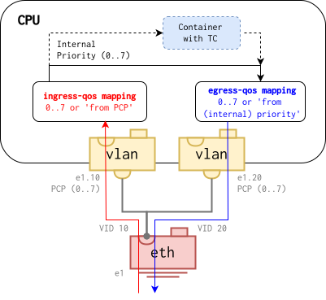

Quality of Service
==================

On occasion, most networks will experience congestion due to some
extraordinary load being placed upon it. If the load is transient,
switches and routers may be able to absorb such bursts of traffic by
queuing packets in internal memories. However, if the load is
sustained over long periods of time, queues will fill up and packets
will start to be dropped. When such situations arise, it is the job of
the network's Quality of Service (QoS) policy to define _which_
packets to drop and which ones to prioritize, such that critical
services remain operational.


## Hardware Forwarded Traffic

The default QoS policy for flows which are offloaded to a switching
ASIC is defined by the hardware defaults of the device in question.


### Marvell LinkStreet

This family of devices, sometimes also referred to as _SOHO_, are
managed by the `mv88e6xxx` driver in the Linux kernel. While older
chips in this family where limited to 4 output queues per port, this
documentation is _only_ valid for newer generations with 8 output
queues per port.


The picture illustrates packets having their priority determined at
ingress, here interface _e1_ and _e3_. In this example, both packets
are forwarded to the same outgoing interface (_e2_), subject to output
queueing. The sections below provides more information on these
topics. 

#### Default Policy

##### Queueing

Both layer 2 ([VLAN PCP][2]) and layer 3 ([IP DSCP][3]) priority marks
are considered when selecting the output queue of an incoming
frame. PCP to queue mapping is done 1:1. For IP packets, the 3 most
significant bits of the DSCP is used to select the queue:

| PCP |  DSCP | ⇒ | Queue | Weight |
|----:|------:|---|------:|-------:|
|   0 |   0-7 | ⇒ |     0 |      1 |
|   1 |  8-15 | ⇒ |     1 |      2 |
|   2 | 16-23 | ⇒ |     2 |      3 |
|   3 | 24-31 | ⇒ |     3 |      6 |
|   4 | 32-39 | ⇒ |     4 |     12 |
|   5 | 40-47 | ⇒ |     5 |     17 |
|   6 | 48-55 | ⇒ |     6 |     25 |
|   7 | 56-63 | ⇒ |     7 |     33 |

For packets containing both a VLAN tag and an IP header, PCP priority
takes precedence over DSCP priority. In cases where neither are
available, packets are always assigned to queue 0.

Each port's set of 8 egress queues operate on a Weighted Round Robin
([WRR][4]) schedule, using the weights listed in the table above. The
sum of all weights adds up to 99, meaning that the weight of any given
queue is roughly equivalent to the percentage of the available
bandwidth reserved for it.

##### Marking

Any priority marks available on ingress are left unmodified when the
frame egresses an output port. In the case when an IP packet ingresses
_without_ a VLAN tag, and is to egress _with_ a VLAN tag, its PCP is
set to the 3 most significant bits of it. If no priority information
is available in the frame on ingress (i.e. untagged non-IP), then
packets will egress out of tagged ports with PCP set to 0.

## Software Forwarded Traffic

For packets which are processed by a CPU, i.e. typically routed
traffic, and bridged traffic between interfaces that do not belong to
the same hardware switching domain, an [nftables container][1] can be
used to define a QoS policy.

For VLAN interfaces, Infix provides support for mapping the Priority
Code Point (PCP) to internal priority on ingress, and the reverse on
egress. 




These `ingress-qos` and `egress-qos` settings are done per VLAN, both
defaulting to '0'. The example below shows how to keep the PCP priority 
for packets being routed between two VLAN interfaces.

```
admin@example:/config/> edit interface e1.10
admin@example:/config/interface/e1.10/> set vlan ingress-qos priority from-pcp 
admin@example:/config/interface/e1.10/> up
admin@example:/config/> edit interface e1.20
admin@example:/config/interface/e1.20/> set vlan egress-qos pcp from-priority 
admin@example:/config/interface/e1.20/> leave
admin@example:/> 
```

## A complex example

The picture below shows a packet flow being subject both to software
forwarding and hardware offloading.


[1]: container.md#application-container-nftables
[2]: https://en.wikipedia.org/wiki/IEEE_802.1Q
[3]: https://en.wikipedia.org/wiki/Differentiated_services
[4]: https://en.wikipedia.org/wiki/Weighted_round_robin
